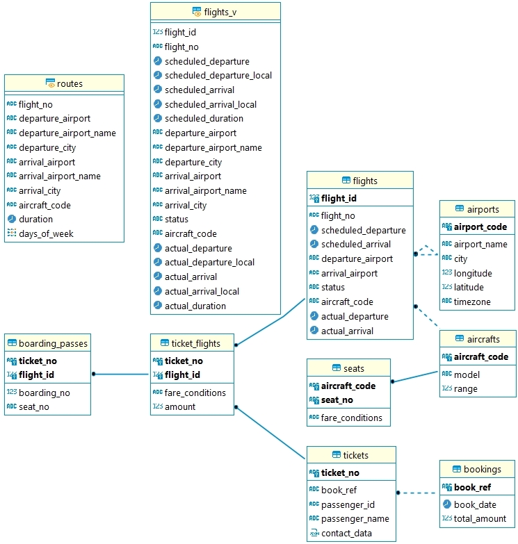

<h1>Проектная работа по модулю “SQL и получение данных”</h1>

<h2>Решения</h2>
<ul>
    <li><a href="./Nephedov-SQL-48.sql">Nephedov-SQL-48.sql</a> - содержащий ряд запросов к БД, согласно условию задания.</li>
</ul>

<h2>Что было сделано</h2>
<ul>
    <li>Установлен PostgreSQL-14.5.1 сервер под Windows x64, на порту 5432.</li>
    <li>Установлен DBeaver-22.1.5 и настроено подключение к серверу postgres.</li>
    <li>Создана пустая база данных "demo".</li>
    <li>Восстановлена база данных из бэкапа - <a href="./avia.backup">avia.backup</a> об авиаперевозках в базу данных "demo".</li>
    <li>Составлен <a href="./Nephedov-SQL-48.sql">sql файл</a>, в котором реализованы sql запросы согласно условиям задания.</li>
</ul>

<h2>Предусловия Задания</h2>

Требования к внешнему виду запросов:
    <ol>
        <li>Решения должны быть приложены в формате *.sql одним файлом.</li>
        <li>Запросы должны быть отформатированы и в читаемом виде.</li>
    </ol>

Для выполнения работы Вам необходимо:
    <ol>
        <li>Ознакомиться с описанием базы данных: <a href="https://edu.postgrespro.ru/bookings.pdf">https://edu.postgrespro.ru/bookings.pdf</a>.
        

Диаграмма схемы данных авиаперевозок.

        
        

        <li>Подключиться к базе данных avia по одному из следующих вариантов - импорт sql запроса из sql файла, представленных на 2 странице описания базы.
    </ol>

<h2>Описание задания</h2>

<table>
  <colgroup>
    <col style="border: 1px solid;" span="3" />
  </colgroup>
    <thead>
        <tr>
            <th>№</th>
            <th>Вопрос</th>
            <th>В решении обязательно должно быть</th>
        </tr>
    </thead>
    <tbody>
        <tr>
            <td>1</td>
            <td>Какие самолеты имеют более 50 посадочных мест?</td>
        </tr>
        <tr>
            <td>2</td>
            <td>В каких аэропортах есть рейсы, в рамках которых можно добраться бизнес - классом дешевле, чем эконом - классом?</td>
            <td>- CTE</td>
        </tr>
        <tr>
            <td>3</td>
            <td>Есть ли самолеты, не имеющие бизнес - класса?</td>
            <td>- array_agg</td>
        </tr>
        <tr>
            <td>4</td>
            <td>Найдите количество занятых мест для каждого рейса, процентное отношение количества занятых мест к общему количеству мест в самолете, добавьте накопительный итог вывезенных пассажиров по каждому аэропорту на каждый день.</td>
            <td>- Оконная функция. - Подзапрос.</td>
        </tr>
        <tr>
            <td>5</td>
            <td>Найдите процентное соотношение перелетов по маршрутам от общего количества перелетов.  
            Выведите в результат названия аэропортов и процентное отношение.</td>
            <td>- Оконная функция. - Оператор ROUND.</td>
        </tr>
        <tr>
            <td>6</td>
            <td>Выведите количество пассажиров по каждому коду сотового оператора, если учесть, что код оператора - это три символа после +7</td>
            <td/>
        </tr>
        <tr>
            <td>7</td>
            <td>Между какими городами не существует перелетов?</td>
            <td>- Декартово произведение. - Оператор EXCEPT.</td>
        </tr>
        <tr>
            <td>8</td>
            <td>Классифицируйте финансовые обороты (сумма стоимости билетов) по маршрутам: 
            До 50 млн - low 
            От 50 млн включительно до 150 млн - middle 
            От 150 млн включительно - high 
            Выведите в результат количество маршрутов в каждом классе.</td>
            <td>- Оператор CASE.</td>
        </tr>
        <tr>
            <td>9</td>
            <td>Выведите пары городов между которыми расстояние более 5000 км</td>
            <td>- Оператор RADIANS или использование sind/cosd</td>
        </tr>
    </tbody>
</table>

Пояснения:
    <ol>
        <li>Рейс, перелет - это flight_id, разовый перелет между двумя аэропортами.</li>
        <li>Маршрут - это все перелеты между двумя аэропортами.</li>
        <li>Кратчайшее расстояние между двумя точками A и B на земной поверхности (если принять ее за сферу) определяется зависимостью: 
        d = arccos {sin(latitude_a)·sin(latitude_b) + cos(latitude_a)·cos(latitude_b)·cos(longitude_a - longitude_b)}, где latitude_a и latitude_b — широты, longitude_a, longitude_b — долготы данных пунктов, d — расстояние между пунктами измеряется в радианах длиной дуги большого круга земного шара.</li>
        <li>Расстояние между пунктами, измеряемое в километрах, определяется по формуле: 
        L = d·R, где R = 6371 км — средний радиус земного шара.</li>
    </ol>

